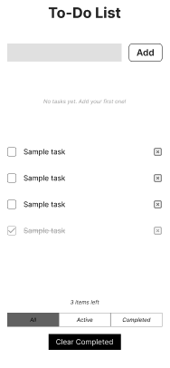
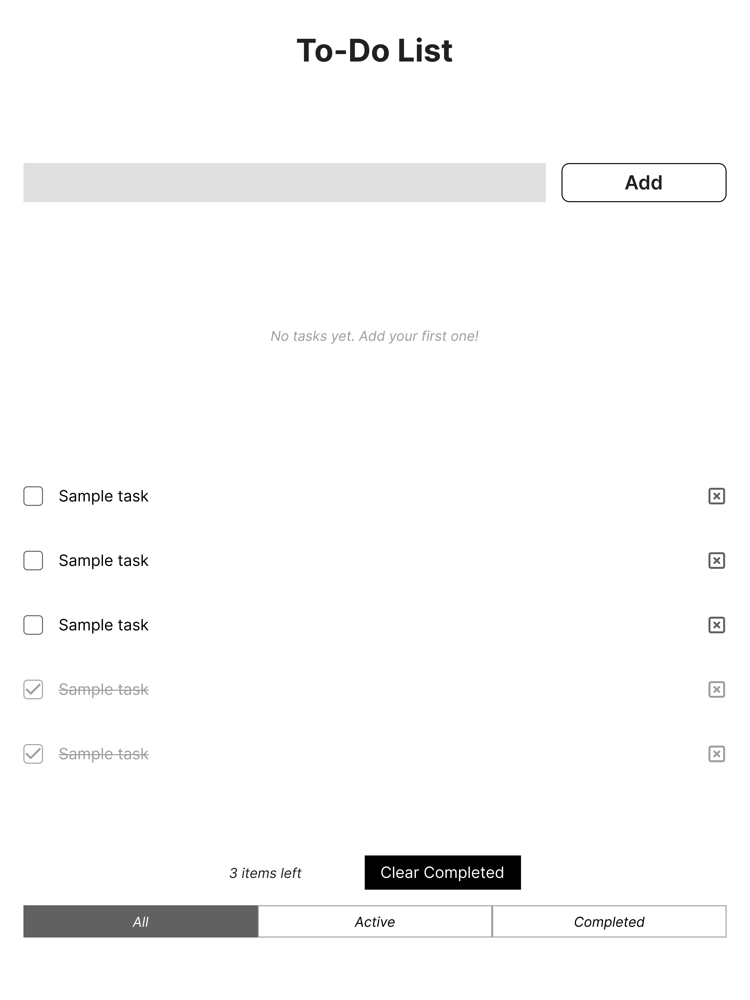
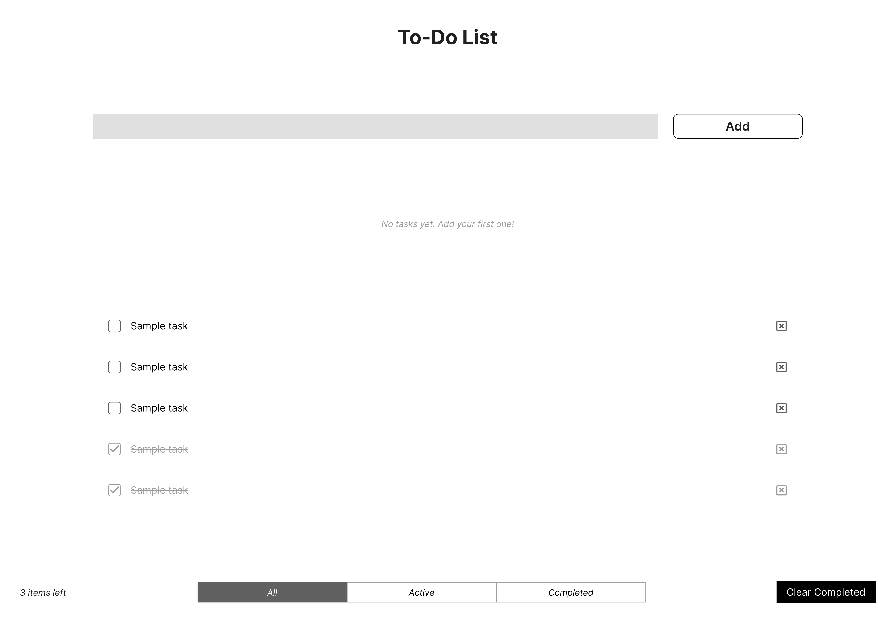

# To-Do List
[To-Do List LiveSite](https://creatvie-introvert.github.io/todo-list/)

The To-Do List App is a simple, responsive, and interactive web application designed to help users organise daily tasks. Built using HTML, CSS, and vanilla JavaScript, it allows users to add, complete, and delete tasks. Tasks are saved in localStorage so they persist between sessions.

---

## Contents
* [User Goals](#user-goals)  
* [User Stories](#user-stories)  
* [Website Goals and Objectives](#website-goals-and-objectives)  
* [Wireframes](#wireframes)  
* [Design Choices](#design-choices)  
  + [Typography](#typography)  
  + [Colour Scheme](#colour-scheme)  
  + [Responsiveness](#responsiveness)  
- [Features](#features)  
  * [Existing Features](#existing-features)  
    + [Header](#header)  
    + [Task Input Section](#task-input-section)  
    + [Task List](#task-list)  
    + [Footer](#footer)  
  * [Future Enhancements](#future-enhancements)  
- [Technologies Used](#technologies-used)  
  * [Languages](#languages)  
  * [Tools](#tools)  
- [Testing](#testing)  
  * [Bugs Fixed](#bugs-fixed)  
  * [Responsiveness Tests](#responsiveness-tests)  
  * [Code Validation](#code-validation)  
    + [HTML](#html)  
    + [CSS](#css)  
    + [JavaScript](#javascript)  
  * [User Story Testing](#user-story-testing)  
  * [Feature Testing](#feature-testing)  
  * [Accessibility Testing](#accessibility-testing)  
  * [Lighthouse Testing](#lighthouse-testing)  
  * [Browser Testing](#browser-testing)  
- [Deployment](#deployment)  
  * [To deploy the project](#to-deploy-the-project)  
  * [To fork the project](#to-fork-the-project)  
  * [To clone the project](#to-clone-the-project)  
- [Credits](#credits)  

---

## User Goals
- Be able to quickly add new tasks with minimal clicks or typing.  
- Clearly see all current tasks in a simple, uncluttered interface.  
- Mark tasks as completed in a satisfying, visual way (e.g., strike-through).  
- Easily delete tasks that are no longer needed.  
- Have tasks saved automatically so they remain after closing/reloading the browser.  
- Access the app across devices (mobile, tablet, desktop) with a responsive layout.  
- Experience smooth, intuitive navigation without distractions.  
- Use the app without needing instructions — interface should feel natural.  
- Have a lightweight tool that loads fast and works offline (localStorage).  

[Back to top](#contents)

---

## User Stories
- As a user, I want to add new tasks so that I can remember things I need to do.  
- As a user, I want to see all my tasks in a clear list so I can stay organised.  
- As a user, I want to mark tasks as complete so I can track my progress.  
- As a user, I want completed tasks to look different (e.g., strike-through) so I can easily see what’s done.  
- As a user, I want to delete tasks so I can remove items I no longer need.  
- As a user, I want my tasks to be saved automatically so I don’t lose them when I refresh the page.  
- As a user, I want the app to work on mobile and desktop so I can manage tasks anywhere.  
- As a user, I want the interface to be simple and fast so I can use it without confusion.  

[View User Stories in GitHub Projects](https://github.com/users/creatvie-introvert/projects/14/views/1?template_dialog_tab=featured&layout_template=board)  
[Back to top](#contents)

---

## Website Goals and Objectives
- Build a simple, responsive, and intuitive task management app using **HTML, CSS, and vanilla JavaScript**.  
- Provide users with a lightweight productivity tool that works entirely in the browser without the need for backend services.  
- Demonstrate core front-end development skills including **DOM manipulation**, event handling, and localStorage persistence.  
- Design a clean and distraction-free interface that adapts across devices, following mobile-first design principles.  
- Ensure accessibility by using semantic HTML, clear colour contrasts, and `ARIA` where needed.  
- Showcase project planning and tracking through **User Stories** linked to **GitHub Projects**.  
- Deploy the app on **GitHub Pages** for public access and portfolio presentation.  

[Back to top](#contents)

---

## Wireframes
Wireframes were designed using a mobile-first approach, then adapted for tablet and desktop layouts.  

<details>
  <summary><b>Mobile Wireframe Preview</b></summary>
  
</details>  

<details>
  <summary><b>Tablet Wireframe Preview</b></summary>
  
</details>  

<details>
  <summary><b>Desktop Wireframe Preview</b></summary>
  
</details>  

[Back to top](#contents)

---

## Design Choices

### Typography
The app uses the Inter font family for its modern, clean, and highly legible style.  
- **Heading / H1 (32px, Bold):** Used for the app title.  
- **Heading / H2 (20px, Semi-Bold):** Used for section headings such as filters.  
- **Body / Paragraph (16px, Regular):** Used for task text, placeholders, and buttons.  
- **Body / Caption (12–14px, Regular/Italic):** Used for secondary text such as task counts.  

### Colour Scheme
The app uses a **light theme only** to keep the interface simple and accessible.  

| Style Name   | Hex Code  | Usage Example             |
|--------------|-----------|---------------------------|
| Background   | #FAF9F6   | Page background           |
| Surface      | #FFFFFF   | Task cards, input fields  |
| Primary Text | #1F1F1F   | Headings, task text       |
| Accent Green | #6B8E23   | Add button, active filter |
| Accent Red   | #E53935   | Delete button/icon        |

**Completed Tasks** are displayed with a **strike-through** and reduced opacity.  

### Responsiveness
The To-Do List app was designed using a mobile-first approach.  

- **Mobile (375×812):**  
  - Single-column layout.  
  - Input field and add button at the top.  
  - Footer stacked vertically.  

- **Tablet (768×1024):**  
  - Increased spacing and padding.  
  - Wider input field.  
  - Footer split into two rows.  

- **Desktop (1440×1024):**  
  - Centred container, max-width ~960–1140px.  
  - Footer elements aligned in one row.  

[Back to top](#contents)

---

## Features

### Existing Features
#### Header
- Displays the app title clearly.  

#### Task Input Section
- Input field for adding new tasks.  
- Add button for quick task creation.  

#### Task List
- Displays all tasks.  
- Each task includes:
  - Checkbox to mark complete.  
  - Strike-through styling for completed tasks.  
  - Delete button with accessible labels.  

#### Footer
- Task counter updates dynamically.  
- Filter buttons (All, Active, Completed) highlight when selected.  
- Clear completed button removes all completed tasks.  

### Future Enhancements
- Drag-and-drop task reordering.  
- Option to edit task text inline.  
- Cloud sync with user accounts.  
- Categories or tags for grouping tasks.  

[Back to top](#contents)

---

## Technologies Used

### Languages
- HTML5  
- CSS3  
- JavaScript (Vanilla)  

### Tools
- Git & GitHub (version control and hosting)  
- GitHub Projects (project management & user stories)  
- VS Code (IDE)  
- Browser DevTools (testing & debugging)  

[Back to top](#contents)

---

## Testing

### Bugs Fixed
- Fixed task list not updating after deletion.  
- Corrected filter highlighting logic so active button updates.  
- Fixed persistence bug with completed tasks after refresh.  

### Responsiveness Tests
- Manually tested on **mobile, tablet, and desktop** breakpoints.  
- Used [Am I Responsive](http://ami.responsivedesign.is/) and BrowserStack.  

### Code Validation
- **HTML:** W3C HTML Validator – passed with no errors.  
- **CSS:** W3C CSS Validator – passed with no errors.  
- **JavaScript:** JSHint – passed with no major warnings.  

### User Story Testing
Each user story was manually tested against the final build. ✅  

### Feature Testing
- Add tasks → appear instantly in the list.  
- Mark complete → text updates visually.  
- Delete → removes task from DOM and localStorage.  
- Filters → display correct subset of tasks.  
- Clear Completed → removes all completed tasks.  

### Accessibility Testing
- Screen reader test (VoiceOver).  
- Checked semantic HTML and ARIA roles.  
- Verified keyboard navigation and focus states.  

### Lighthouse Testing
Placeholder screenshot:  
  

### Browser Testing
Tested successfully on:  
- Chrome  
- Firefox  
- Safari  
- Edge  

[Back to top](#contents)

---

## Deployment

The To-Do List app was developed and deployed using GitHub Pages.  

### To Deploy the Project
1. Log in to GitHub and navigate to the repository.  
2. Click on the **Settings** tab.  
3. In the side menu, select **Pages**.  
4. Under Branch, select **main** and `/root`.  
5. Click **Save**.  

The live site will be available at:  
[To-Do List App Live]()

### To Fork the Project
1. Log in to GitHub.  
2. Navigate to the repository page.  
3. Click the **Fork** button in the top-right.  

### To Clone the Project
1. Log in to GitHub.  
2. Navigate to the main page of the repository.  
3. Click the green **Code** button and copy the link.  
4. In your terminal:  
   ```bash
   git clone https://github.com/creatvie-introvert/todo-list